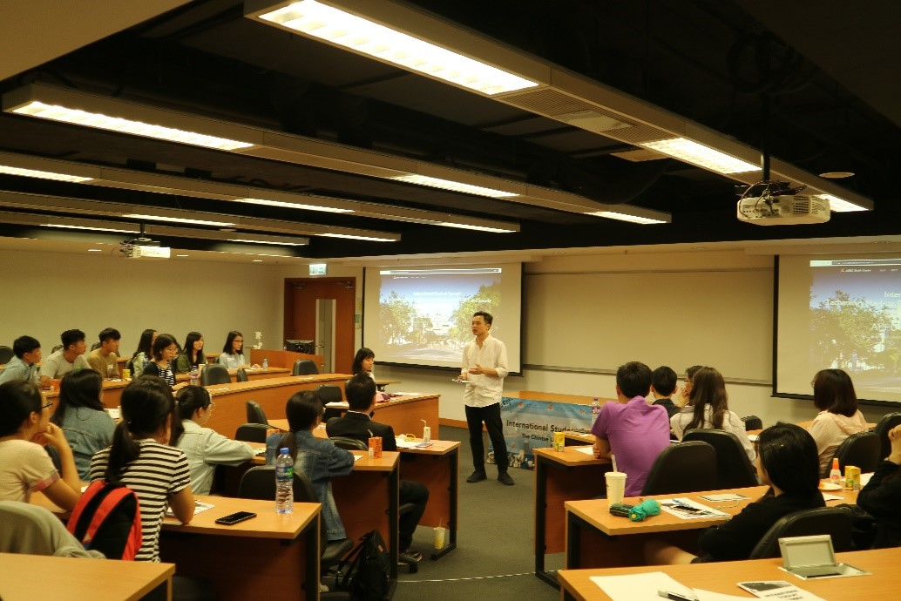
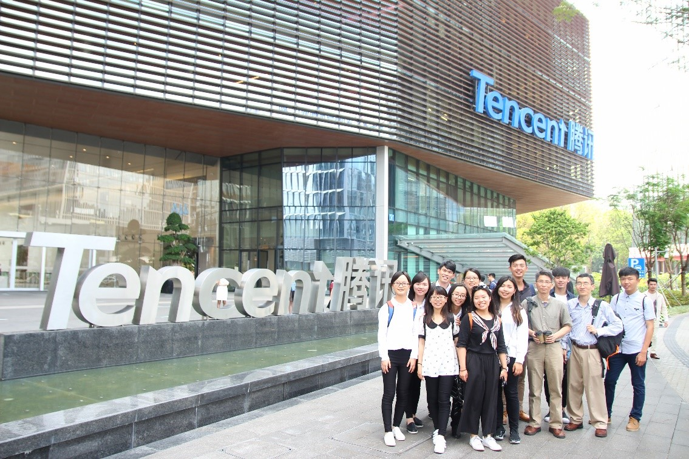
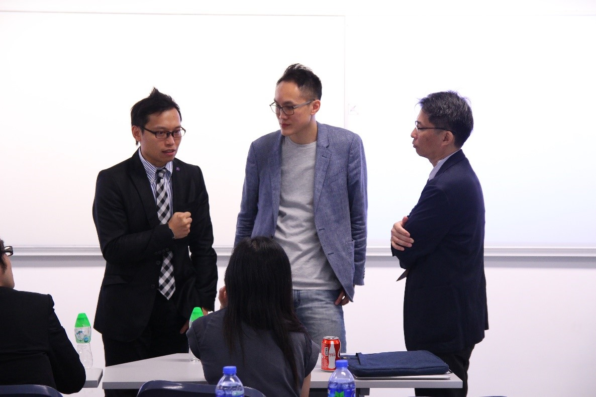

#Table of Content
[TOC]
@import "ISS_report_footnote.md"

# Introduction
The International Student Summit 2018 (ISS) is run by APEC Study Centre, The Chinese University of Hong Kong (ASC, CUHK) as a commissioned project output by Trade and Industry Department (TID). This assessment report serves as a record and evaluation for future similar activities reference.
## Objective
ISS is an project output, it is organized with respect to the theme of *Human Capital development in APEC member economies* [^HC]. It aims to facilitate the knowledge transfer and peer learning environment between APEC economies students. ISS invited university students from different member economies to work on the theme “Technology Start-ups, Business Environment for SMEs, and Society” from the perspective of their own economy. **Student are required to work in teams, to submit a report on one of these study area and to present in the ISS to share their study result to the other ISS participates.**

## ISS basic information
The ISS lasts for 3 days 2 night, the event was leaded and organized by [Dr Ku Kei-tat, Fred, CUHK](http://www.cuhk.edu.hk/clear/tea/Dr_KU_K_T.html), ASC, CUHK member. Besides CUHK local students, we invited university students and their faculty members from Macau, Taiwan and Thailand. The universities are City University of Macau, National Chiayi University (NCYU) and Thammasat University respectively. The following table describes the basic information of the ISS:

| ISS Basic Information||
| :-------------: | :------------- |
| Date           | 10 - 13 May 2018|
|Location[^loc]| CUHK
|^| Wu Kwai Sha Youth Village, YMCA Hong Kong|
|Participants[^parti]|Student: 26 |
|^|Teachers: 4|
|^|CUHK Helpers: 7|
|^|CUHK Core-Helpers: 5|
|^|Judges: 2|
|^|Speakers: 2|
|^|**In total: 46** |

# ISS activities
Most of the ISS activities are launched during the day-light time. The following is the main activities:
|Day|Activities|
|:-:|:-:|
|1|Opening Ceremony & Ice Breaking|
|^|Dinner BBQ & Day2 Tencent Firm Visiting Briefing|
|2|Qianhai Visit & Tencent Firm Visit, ShenZhen, China|
|3|Research presentation & Guest Talk|

## Day 1
### Open ceremony
The Open ceremony of ISS was held at 2:3 0pm in Cheng Yu Tung Building, CUHK. Participants was welcomed by Prof. Travis Ng, Director of APEC Study Centre, CUHK.

*Prof. Ng shared his insights on the impact of technology on business and also encouraged young participants to explore.*

### BBQ Dinner
Team building activities and other events were hosted in the campus of CUHK, and a BBQ dinner to connect participants from various countries and places was held in Wu Kwai Sha Youth Village, YMCA Hong Kong.

*Dr Fred Ku had BBQ Dinner with ISS international participants*

## Day 2
### Visiting QianHai
In the morning, Participants was arranged to get on the shuttle bus to Qianhai Headquarter, Shenzhen, to learn about the development of startup environment and incubation in the Southern part of China.

*Qianhai Headquarter visit*
### Visiting Tencent
In the afternoon, participants was arranged to visit Tencent headquarter.
The objective of the visit is to have better understanding of Tencent Holding Limited, one of the biggest China technology giants. Participants not only could visit the Tencent new headquarter, which was a combination of the latest design and technology, but also had the opportunity to learn about their development and business strategies.

*Tencent Headquarter visit*

## Day 3
### Research Presentation
Participants presented their research findings their respective local technology start-ups. They documented the story of a selected technology startup from their country/region, analysed the reasons for their successes, and proposed further development.

There are 7 presentation, the respective institution, topic and presentation material are the following :

| University | Research Topic     | Presentation material|
| :-: | --: |:-|
| University of Macau      | [NetCraft](http://www.netcraft.com.mo/)|[.PPT](https://drive.google.com/file/d/0BwPRuRIzH5jdbF9OQmpfMjBxb2NWMGcxNk4zN0hIbnlQN29r/view?usp=sharing)|
|CUHK|[Rover](https://www.rover.com/)|[.PPT](https://drive.google.com/open?id=0BwPRuRIzH5jdZTItRTlfSlN0Nk5CQTJrb3JiOHVoSm5mUndB)|
|City University of Macau| [Swivl](https://www.swivl.com/)|[.PPT](https://drive.google.com/open?id=0BwPRuRIzH5jdTjE0UHFJOEVva044RVRYN2JsTFFJN04yNjU0)|
|NCYU|[Backer-Founder](https://www.backer-founder.com/)|[.PPT](https://drive.google.com/open?id=0BwPRuRIzH5jdYm9EVk9zNnNodFd2Zy0wSXl1SEVXS291OVp3)|
|NCUY|[nextDrive](https://www.nextdrive.io/en/)|[.PPT](https://drive.google.com/open?id=0BwPRuRIzH5jdV2RTZXpsb3d1M3BIamQxNTdLem84bUxfbUQ4)|
|NCUY|[GOGORO](https://www.gogoro.com/)|[.PPT](https://drive.google.com/open?id=1MB9CLuw_BqOOt0NYzLQlFVdvVhR3NQba)|
|NCUY|[WeMo Scooter](https://www.wemoscooter.com/)|[.PPT](https://drive.google.com/open?id=1mwx-LjFPo8bDWp5U92ekfNfW9-Y7S32i)|

### Guest Talk
[Mr. Keith Wong](https://hk.linkedin.com/in/keithwong1128) is invited as a guest for sharing his thoughts on **The Entrepreneurial Environment for Technology Start-ups in Hong Kong**. Keith is an entrepreneur, who graduated from CUHK MBA programme, shared with all participants the startup environment in Hong Kong and his thoughts and experience of his own start-up journey. The following is his short biography:

>Keith Wong, who was  CUHK MBA second year student in 2018, completed his master in information and technology management in CUHK in 2011. In 2016, he also obtained the big data and social analytics certificate from Massachusetts Institute of Technology.
>
>After his graduation of BEng degree in industrial and systems engineering from the Hong Kong Polytechnic University, Keith joined Tectura Hong Kong Limited, an IT consulting company, as a Microsoft Business Solution consultant. He managed the first vertical industry focused team in the company. His last position was a retail intelligent team lead, which focuses on providing consulting service in retail sector by implementing Microsoft business solution to his clients.
>
>In March 2018, Keith quited his job and commence BuddiGo, his start-up business in Inspirit Studio Limited, with five founders.  He currently is the chief information officer, leading the R&D team, focusing on the fund-raising, and exploring the business opportunities in overseas countries.

*From left to right: Dr Fred Ku, CUHK; Mr Keith Wong, BuddiGo; Prof Chi-Leung Chu, NCYU*

# Evaluation
The ISS was a successful event. Participants found it eye-opening and they treasured the opportunities to learn about the latest development in technology startups in both Hong Kong and Shenzhen, China and to understand the successful cases of tech start-ups from HK, Taiwan, and Thailand. The cultural exchange among participants from various places was also invaluable.

## Note for further development
- Preparation needs to start as early as possible to work out schedule for firm visits and arrange accommodation
- Participants also need more time for preparation and conducting their studies;
- Due to financial constraints, it may not be easy for SE Asian teams to join. Subsidy is very important to attract those teams.
